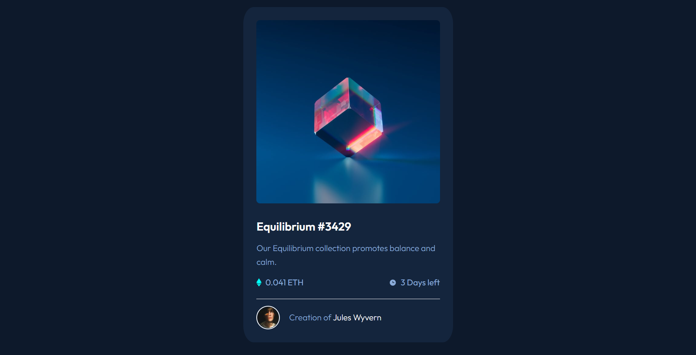

# Frontend Mentor - NFT preview card component solution

This is a solution to the [NFT preview card component challenge on Frontend Mentor](https://www.frontendmentor.io/challenges/nft-preview-card-component-SbdUL_w0U). Frontend Mentor challenges help you improve your coding skills by building realistic projects.

## Table of contents

- [Overview](#overview)
  - [The challenge](#the-challenge)
  - [Screenshot](#screenshot)
  - [Links](#links)
- [My process](#my-process)
  - [Built with](#built-with)
  - [What I learned](#what-i-learned)
  - [Continued development](#continued-development)
  - [Useful resources](#useful-resources)
- [Author](#author)
- [Acknowledgments](#acknowledgments)

**Note: Delete this note and update the table of contents based on what sections you keep.**

## Overview

### The challenge

Users should be able to:

- View the optimal layout depending on their device's screen size
- See hover states for interactive elements

### Screenshot

Picture of the solution

### Links

- Solution URL: [Github repo](https://github.com/jtsenpai/NFT-preview-card)
- Live Site URL: [NFT-Preview Page](https://jtsenpai.github.io/NFT-preview-card/)

## My process

### Built with

- Semantic HTML5 markup
- CSS custom properties
- Flexbox

### What I learned

I have been having trouble with flexbox lately. Had to relearn it through YouTube and after getting the concept, I chose this particular challenge to work on it. I learned a lot more about flexbox while doing this task

### Continued development

Now that I have grasped the concept of flexbox. I need to understand CSS Grid and CSS Frameworks

## Author

- Linkedin - [Jesutoni Odufeso](https://www.linkedin.com/in/jesutoni-odufeso-25b1b9223)
- Frontend Mentor - [@jtsenpai](https://www.frontendmentor.io/profile/jtsenpai)
- Twitter - [@jtsenpai002](https://twitter.com/jtsenpai002)
